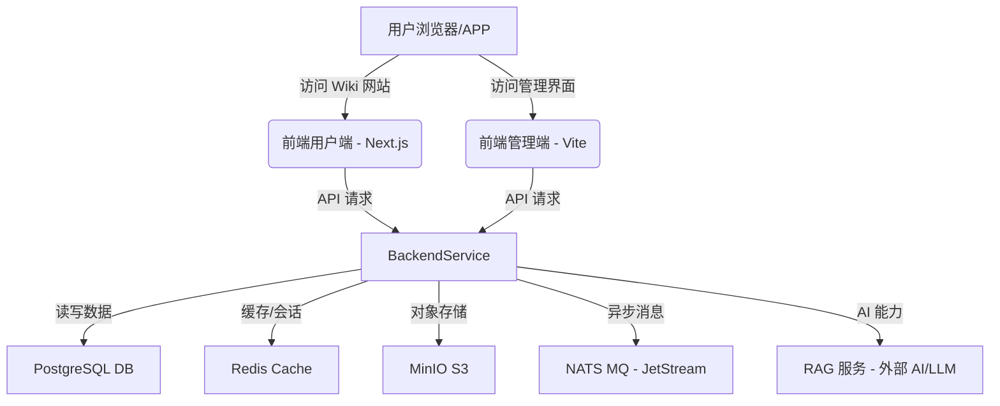

# PandaWiki 架构与技术栈

## 1. 整体架构

PandaWiki 采用典型的**前后端分离**的微服务架构，核心组件包括：

-   **后端服务 (Backend Service)**: 基于 Go 语言，提供 API 接口、业务逻辑处理、数据存储与集成。
-   **前端管理端 (Admin Console)**: 基于 React/Vite，提供管理员界面，用于知识库内容、用户、系统配置等管理。
-   **前端用户端 (Wiki Website)**: 基于 Next.js/React，提供面向最终用户的 Wiki 网站，展示知识库内容并提供搜索、问答功能。
-   **SDK (Software Development Kit)**: 提供与 PandaWiki 核心功能交互的客户端库。
-   **依赖服务 (Dependency Services)**: 包括 PostgreSQL、NATS、Redis、MinIO 等，提供数据存储、消息队列、缓存和对象存储服务。
-   **RAG 服务 (Retrieval-Augmented Generation Service)**: 外部 AI 大模型服务，提供 AI 创作、问答、搜索的核心能力。

## 2. 技术栈详情

### 2.1 后端 (Backend)

-   **语言**: Go 1.24+
-   **框架**: Echo (Web 框架)
-   **依赖管理**: Go Modules
-   **依赖注入**: Wire
-   **数据库**: PostgreSQL (GORM ORM)
-   **消息队列**: NATS (支持 JetStream)
-   **对象存储**: MinIO (兼容 S3 协议)
-   **缓存**: Redis
-   **认证**: JWT
-   **可观测性**: Sentry (错误监控), OpenTelemetry (APM)
-   **API 文档**: Swag (Swagger/OpenAPI 自动生成)

### 2.2 前端 (Frontend)

项目采用 [pnpm monorepo](https://pnpm.io/workspaces) 结构管理多个前端应用。

#### 2.2.1 管理端 (web/admin)

-   **框架**: React
-   **构建工具**: Vite
-   **UI 组件**: Material-UI (MUI)
-   **状态管理**: Redux Toolkit (根据代码推断)
-   **路由**: React Router DOM (v6)
-   **代码规范**: ESLint, Prettier
-   **API 客户端**: cx-swagger-api (从 Swagger 生成的客户端)

#### 2.2.2 用户端 (web/app)

-   **框架**: Next.js 15.3.2, React 19
-   **UI 组件**: Material-UI (MUI), 自定义 UI 库 (`@panda-wiki/ui`)
-   **Markdown 解析**: `markdown-it`, `react-markdown` (支持 KaTeX, highlight.js)
-   **包管理**: pnpm
-   **代码规范**: ESLint, TypeScript 5

### 2.3 SDK (sdk/rag)

-   **语言**: Go
-   **功能**: RAG (Retrieval-Augmented Generation) 客户端库，用于与 RAG 服务交互。

### 2.4 其他组件

-   **pageIndex**: Python 脚本，可能用于页面索引或特定数据处理（本会话中忽略）。

## 3. 数据流与交互

1.  **用户访问**：用户通过浏览器访问 `localhost:3010` (用户端) 或 `localhost:5173` (管理端)。
2.  **前端请求**：前端应用通过 HTTP API 调用后端服务 `localhost:8000`。
3.  **后端处理**：
    -   API 网关处理请求，通过中间件进行认证、日志记录等。
    -   业务逻辑层处理具体业务，与数据库 (PostgreSQL)、缓存 (Redis)、对象存储 (MinIO) 交互。
    -   与消息队列 (NATS) 交互，处理异步任务（如 RAG 任务）。
    -   调用 RAG 服务 (外部 AI/LLM) 获取 AI 能力。
4.  **数据存储**：
    -   **PostgreSQL**: 存储业务数据，如用户、知识库、文档、配置等。
    -   **Redis**: 存储会话、缓存数据等。
    -   **MinIO**: 存储文件、图片等静态资源。
5.  **AI 集成**：RAG 服务作为独立的 AI 能力提供方，后端通过 HTTP 接口调用 RAG 服务，获取 AI 创作、问答、搜索结果。
